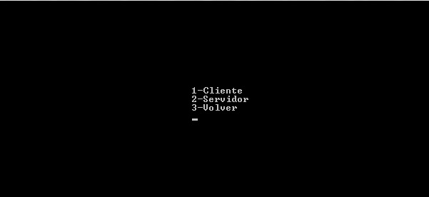
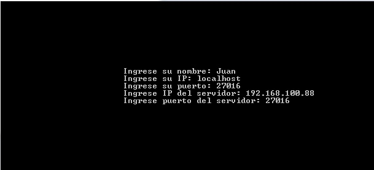

# Batalla_Naval

ACLARACION: Codigo rescatado de varios mails, ya que el original fue borrado en un inconveniente con el hardware.

Este es un proyecto que fue presentado como trabajo final para la materia Informatica 1 de la Universidad Nacional de Moreno, en el año 2016. Fue mi primer acercamiento a la programacion y queria agradecer al Ing. Matias Bassi por su guia y al Ing. Gustavo Pascual, que estaba a cargo de la catedra.
Si bien al codigo le faltan funciones para tener un resultado mas acabado en cuanto a funcionamiento, se logro tener esta primer version de un juego con mis primeros conocimientos en este campo a traves del lenguaje C.

Se representan dos tableros clásicos del juego, radares enemigo y aliado, donde se coloca nuestra flota de barcos (tres), con tres casilleros cada uno. Mediante una coneccion TCP se pasan coordenadas para descubrir la localización de la flota enemiga y hundir todos los acorazados. 

#iniciando el juego

En el menu principal encontraras el titulo y las opciones jugar y salir.

#Jugar

En la opcion jugar  tenes las siguientes opciones:

Como cliente te conectaras a la partida del servidor y empezaras el juego recibiendo un ataque.
Como servidor seras el primero en atacar y el que espere los datos del cliente para comenzar el juego.
Con ambas opciones, tanto servidor como cliente, deberan cargar datos para la conexion. 

#Comenzando el juego
Antes de comenzar los ataques se deberas ubicar los barcos en tu radar. Los barcos figuraran en el tablero con los siguientes simbolos: '?' - '¿' - '@'.

*Recorda poner las letras en mayuscula*

Una vez ingresados los barcos iniciara la batalla. Si eres cliente quedaras esperando un ataque y si sos servidor atacaras.

Ya habiendo derrotado la flota enemiga aparecera en la pantalla un mensaje: “GANASTE” o “PERDISTE ...JAJAJA”.
Luego, presionando enter volvera al menu donde elegiste ser servidor o cliente.
